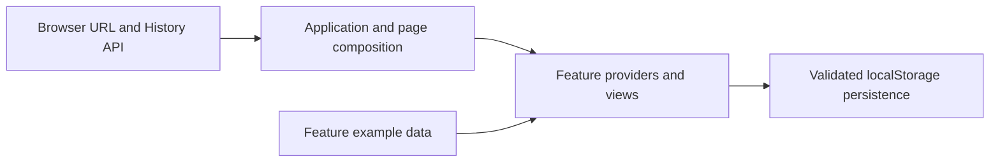

# System overview

Devspace is a React 19 and TypeScript single-page application built with Vite. The browser renders all screens and persists user data in localStorage. There is no implemented backend, authentication, or cross-device synchronization. Operations status is example data, and milestones currently display project milestone strings.

See [frontend architecture](frontend.md) for source responsibilities and data flow, [development](../guides/development.md) for commands, and [plans](../plans/README.md) for execution status. The [backend API contract](../references/api/backend-api-contract.md) describes an unimplemented design, not current runtime behavior.
