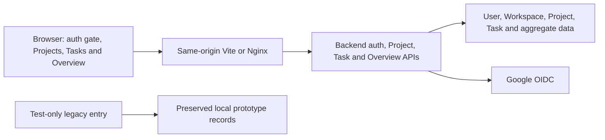

# System overview

Devspace is a React 19 and TypeScript SPA built with Vite. Its default entry authenticates through the existing backend session and displays backend User/PersonalWorkspace data. Projects and Tasks use backend data and mutations; Overview supplies independent counters. The Task page retains its established UI; Home temporarily shows a Task-only board beside Overview. Journal, Milestone, Link and Dashboard APIs, Dashboard defaults and automatic seeding remain excluded.

Identity, CSRF and request lifecycle state are memory-only. The backend owns HttpOnly session cookies and authorization. Browser resumption, session loss, logout and account changes retire private state and revalidate as appropriate. Legacy localStorage remains untouched and has no authenticated authority.

See [frontend architecture](frontend.md), [development and deployment inputs](../../README.md), [PLAN-0006](../plans/PLAN-0006-frontend-auth-http-integration.md) and [PLAN-0007](../plans/PLAN-0007-project-overview-integration.md). The historical [API proposal](../references/api/backend-api-contract.md) is not the current contract authority. Required local acceptance uses a disposable frontend-owned OIDC fixture against the unchanged real backend security chain and PostgreSQL; production Google/TLS deployment remains outside this work.
